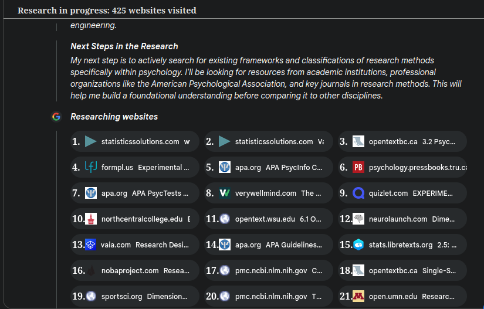
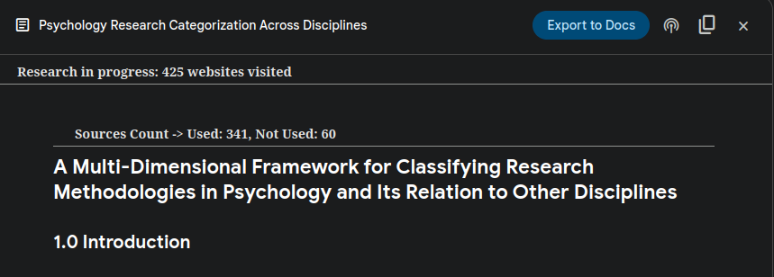

# Gemini Deep Research Source Counter

This userscript enhances the Google Gemini web interface (`gemini.google.com`) by providing quantitative details about the sources utilized during its "Deep Research" operations.

## Description

When Gemini performs deep research (often triggered by complex queries requiring web lookups), it consults various web sources. This script modifies the Gemini interface to:

1.  **Count Sources:** It identifies and counts the number of sources categorized as "Used sources" and "Not used sources" after the research is complete.
2.  **Count Research Websites:** It tracks and counts the websites Gemini accesses *during* the research phase (visible in the "Thinking..." panel).
3.  **Display Counts:** It injects a summary line at the top of the relevant response container, displaying the counts (e.g., `Sources Count -> Used: X, Not Used: Y, Research Websites: Z`).
4.  **Display Active Research Count:** While research is actively in progress, it displays a live count of visited websites (e.g., `Research in progress: X websites visited`).
5.  **Number Items:** It adds sequential numbering (1., 2., 3., ...) to each item within the "Used sources" list, the "Not used sources" list, and the research website chips shown during the thinking phase for easier cross-referencing.

The script uses a `MutationObserver` to detect and process new Gemini responses and research updates dynamically as they appear on the page, ensuring it works correctly within the single-page application nature of Gemini, including across chat switches.

## Features

* **Source Counting:** Accurately counts sources listed under "Used sources" and "Not used sources".
* **Research Website Counting:** Counts website chips displayed during the active research/thinking phase.
* **Combined Display:** Presents a consolidated count summary (`Sources Count -> Used: X, Not Used: Y, Research Websites: Z`) above completed deep research responses.
* **Active Research Counter:** Shows a real-time counter specifically for websites visited during the ongoing research process.
* **Sequential Numbering:** Applies numerical prefixes (1., 2., 3., ...) to all items in both source lists (Used/Not Used) and to the research website chips.
* **Dynamic Operation:** Automatically processes new Gemini responses and research panels as they are added to the DOM.
* **Robust Identification:** Uses specific HTML element selectors and data attributes (`data-sources-counted`, `data-research-counted`, `data-research-in-progress`) to target relevant content and avoid redundant processing.
* **Persistent Functionality:** Operates correctly even when switching between different chats within the Gemini interface.

## Preview

### Ongoing Research

### Completed Research

## Installation

1.  **Install a Userscript Manager:** You need a browser extension capable of running userscripts. Choose one compatible with your browser:
    * [Tampermonkey](https://www.tampermonkey.net/) (Recommended: Chrome, Firefox, Edge, Opera, Safari)
    * [Violentmonkey](https://violentmonkey.github.io/) (Chrome, Firefox, Edge, Opera)
    * [Greasemonkey](https://www.greasespot.net/) (Firefox)

2.  **Install the Script:** Click the link below to navigate to the script file. Your userscript manager should intercept it and prompt for installation.
    * **[Install Gemini Deep Research Source Counter](https://raw.githubusercontent.com/InvictusNavarchus/gemini-source-counter/master/gemini-source-counter.user.js)**
    *(This link uses the `@downloadURL` from your script header)*

3.  **Confirm Installation:** The userscript manager will display information about the script (name, version, domains it runs on). Review the details and confirm the installation. The script requires access to `https://gemini.google.com/*`.

## Usage

1.  Ensure the userscript is enabled in your userscript manager.
2.  Navigate to [https://gemini.google.com/](https://gemini.google.com/).
3.  Submit a prompt likely to trigger Gemini's deep research functionality (e.g., ask a complex question requiring current information synthesis from multiple web sources).
4.  Observe the interface:
    * **During Research:** As Gemini shows the "Thinking..." or equivalent panel with website chips, the "Research in progress..." counter will appear and update. The chips themselves will be numbered.
    * **After Research:** Once the response is generated and includes the "Used sources" and/or "Not used sources" sections, the "Sources Count -> ..." summary will appear above the response content. Items within the source lists will be numbered.

The script runs automatically; no manual activation is required beyond the initial prompt that triggers deep research.

## Compatibility

* **Browsers:** Primarily developed and tested on recent versions of Chrome and Firefox. Expected to work on other browsers that support compatible userscript managers.
* **Userscript Managers:** Tampermonkey, Violentmonkey, Greasemonkey.
* **Target Website:** `https://gemini.google.com/*`

**Important Note:** Web interfaces like Google Gemini are subject to frequent updates. Changes to the underlying HTML structure, CSS class names, or element IDs used by Gemini could potentially break this script's functionality. If the script stops working, it likely requires updates to its element selectors (`const` variables defining selectors in the code) to match the new interface structure.

## License

Licensed under GNU General Public License v3